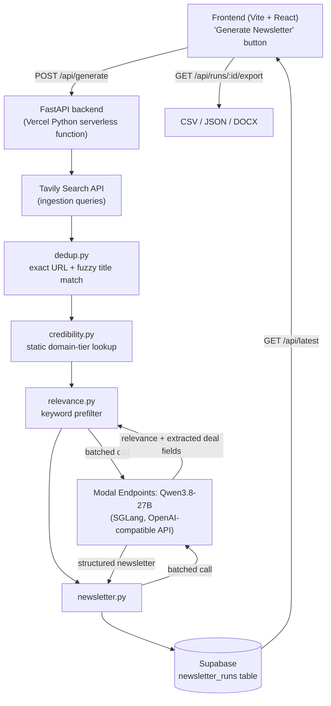

# FMCG-Intel

An AI-powered intelligence pipeline that discovers, filters, deduplicates, validates, and summarizes recent FMCG M&A and investment activity into a concise business newsletter.

- **Demo app**: _add Vercel URL after deploy_
- **Repo**: this repository

## What it does

Click "Generate Newsletter" and the app runs a full pipeline live: it searches the web for recent FMCG deal news, removes duplicate/near-duplicate coverage of the same story, filters out anything that isn't actually an FMCG deal, tags each source's credibility, and drafts a short structured newsletter — all in one run, saved with a timestamp so the UI always shows "last updated" alongside the latest edition.

## Architecture



**Components**

| Layer | Tech | Role |
|---|---|---|
| Frontend | Vite + React (TS) | "Generate" button, renders latest newsletter, download links |
| Backend | FastAPI, deployed as a Vercel Python serverless function (`api/index.py`) | Orchestrates the pipeline, serves `/api/generate`, `/api/latest`, `/api/runs/{id}/export`, `/api/modal-status` |
| Sourcing | Tavily Search API | Real-time news search across a fixed set of FMCG-deal queries |
| Scoring/drafting | Qwen3.8-27B served via Modal Endpoints (SGLang, OpenAI-compatible `/v1/chat/completions`, bearer-token auth) | Confirms relevance + extracts deal fields; drafts the structured newsletter |
| Storage | Supabase (Postgres) | One timestamped row per pipeline run |

Everything runs **on-demand**: a user click triggers the full pipeline synchronously, writes the result to Supabase, and the frontend re-renders with the new run.

### Modal cold starts

The LLM container scales to zero when idle, so it isn't always warm. A fresh request wakes it, but that first request can 503 immediately while the container spins up (a 27B model's weights can take a couple of minutes to load), rather than queuing and waiting. In practice this means **Generate can fail if the model isn't already live**.

To make this visible, the UI has a **"Warm Up" / "Recheck"** control next to Generate (`ModalStatusBadge`) backed by `GET /api/modal-status` (`check_status()` in `backend/pipeline/modal_client.py`), which pings the endpoint's lightweight `/v1/models` route every 5 seconds — each ping also serves as a wake-up trigger — and shows a status dot: grey (unknown) → amber pulsing ("Starting…") → green ("Live"). Generate itself isn't blocked on this status; it's there so you can confirm the model is actually up before running the full pipeline instead of finding out via a failed run.

## Pipeline: ingestion → cleaning → scoring → newsletter

1. **Ingestion** (`backend/pipeline/ingest.py`) — Fires a fixed set of Tavily searches tuned for FMCG deal activity (e.g. "FMCG acquisition news", "consumer goods company merger", "FMCG startup funding round"), scoped to the last 7 days. Each hit is normalized into an `Article` record (title, url, snippet, published date, source domain).

2. **De-duplication** (`backend/pipeline/dedup.py`) — Deliberately rule-based, no embeddings, so it's fast and easy to audit:
   - **Exact pass**: normalize each URL (strip query params/tracking, lowercase host) and drop repeats.
   - **Near-dup pass**: fuzzy-match titles pairwise with RapidFuzz's `token_sort_ratio` (threshold 85). Two articles above that threshold are treated as the same underlying story; we keep the copy from the higher-credibility source and record the other outlet(s) in `also_reported_by`, so the newsletter can cite multiple sources for one deal instead of silently dropping coverage.

3. **Credibility check** (`backend/pipeline/credibility.py`) — A static, transparent domain-tier lookup:
   - **Tier A**: major wire/financial press (Reuters, Bloomberg, WSJ, FT, AP, CNBC, Economic Times, Mint, Business Standard, Moneycontrol).
   - **Tier B**: recognized trade press (FoodDive, ETRetail, Just Food, FoodBev, Retail Dive, PR Newswire, etc.).
   - **Tier C**: anything not on the list, flagged "unverified source" rather than dropped — credibility informs trust in the newsletter, it doesn't gate inclusion.
   - This runs before dedup so near-duplicate merging always keeps the most credible copy of a story.

4. **Relevance scoring** (`backend/pipeline/relevance.py`) — Two stages, cheapest first:
   - **Keyword prefilter**: an article must mention both an FMCG/category term (e.g. "consumer goods", "packaged food", "beverage") **and** a deal term (e.g. "acquisition", "stake", "funding", "merger") to survive. This removes the obviously-irrelevant majority for free.
   - **LLM confirmation**: survivors are sent to the Modal-hosted Qwen3.8-27B endpoint in **one batched call**, which confirms relevance and extracts structured deal fields (companies, deal type, amount, one-line summary) — reused directly by the newsletter drafter, avoiding a second LLM pass.

5. **Newsletter drafting** (`backend/pipeline/newsletter.py`) — One more batched Modal call turns the deduped, relevant, credibility-tagged articles into a structured newsletter: grouped sections (e.g. "Top Deals", "Funding Rounds"), each deal with a headline, companies, deal type/size, a 1-2 sentence summary, sources, and credibility tier. Stored as both markdown and structured JSON.

6. **Persistence + export** — The full run (raw articles, dedup/relevance/credibility metadata, newsletter markdown + JSON, timestamp) is saved as one row in Supabase's `newsletter_runs` table. `/api/runs/{id}/export` serves the raw data as CSV or JSON, or the newsletter as a DOCX (via `python-docx`).

### Assumptions worth calling out
- Credibility is a static allowlist, not a live reputation score — it's transparent and auditable but needs manual upkeep as new trade outlets appear.
- Near-duplicate detection compares titles only (not full body text) — cheap and effective for deal headlines, but could in principle merge two distinct deals with coincidentally similar titles (threshold tuned to 85 to keep this rare).
- Relevance and deal-field extraction rely on the LLM's read of the title/snippet only, not the full article body — kept deliberately lightweight to keep each batched LLM call fast, not because of a platform time limit (Vercel's Fluid compute defaults to a 300s function duration, well above what this pipeline needs).

## Repo layout

```
fmcg-intel/
├── frontend/            # Vite + React + TS demo UI
├── api/index.py         # FastAPI app entrypoint (Vercel ASGI function)
├── backend/
│   ├── pipeline/         # ingest, dedup, credibility, relevance, newsletter, export
│   ├── db/                # Supabase client
│   ├── models/            # Pydantic schemas
│   └── orchestrator.py    # runs the full pipeline end-to-end
├── supabase/schema.sql   # newsletter_runs table DDL
└── tests/                 # pytest unit tests for dedup + credibility logic
```

## Running locally

**Backend + LLM**
```bash
python -m venv .venv && source .venv/bin/activate
pip install -r requirements-dev.txt
cp .env.example .env   # fill in TAVILY_API_KEY, MODAL_LLM_ENDPOINT_URL, MODAL_API_TOKEN, SUPABASE_URL, SUPABASE_SERVICE_ROLE_KEY

uvicorn api.index:app --reload --port 8000
```

**Frontend**
```bash
cd frontend
npm install
npm run dev
```

**Tests**
```bash
pytest
```

## Deploying

1. **Modal**: deploy Qwen3.8-27B (or another instruct model) via Modal's Endpoints product with authentication turned on. Copy the endpoint's base URL into `MODAL_LLM_ENDPOINT_URL` and its bearer proxy token into `MODAL_API_TOKEN`. The backend calls `POST {MODAL_LLM_ENDPOINT_URL}/v1/chat/completions` (OpenAI-compatible) with `Authorization: Bearer <token>`.
2. **Supabase**: create a project, run `supabase/schema.sql` in the SQL editor, grab the project URL + service role key.
3. **Vercel**: import this repo. `vercel.json` defines two [Services](https://vercel.com/docs/services) sharing one deployment — `frontend` (root `frontend/`, auto-detected as Vite) and `backend` (root `.`, entrypoint `api.index:app`, a FastAPI service with `maxDuration: 300`). Requests to `/api/*` route to the backend, everything else to the frontend. Set `TAVILY_API_KEY`, `MODAL_LLM_ENDPOINT_URL`, `MODAL_API_TOKEN`, `MODAL_MODEL_NAME`, `SUPABASE_URL`, `SUPABASE_SERVICE_ROLE_KEY` as environment variables in the Vercel project settings.

## Deliverables checklist
- [x] Demo app (Vercel) — link above
- [x] GitHub repo with README + architecture diagram — this repo
- [x] Raw data export (CSV/JSON) — `GET /api/runs/{id}/export?format=csv|json`
- [x] Pipeline explanation with dedup/relevance logic — above
- [x] Structured newsletter export (DOCX) — `GET /api/runs/{id}/export?format=docx`
